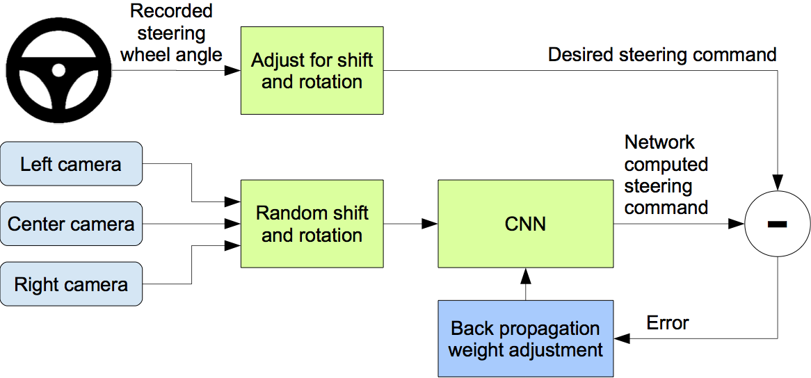
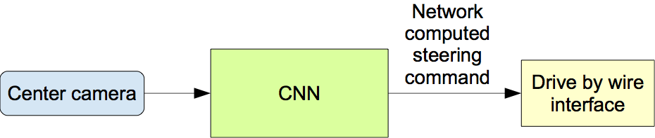

# Virtual Self Driving Car

This project was inspired by the article, [End to End Learning for Self-Driving Cars](http://images.nvidia.com/content/tegra/automotive/images/2016/solutions/pdf/end-to-end-dl-using-px.pdf), published by Nvidia. The project focuses on the implementation of convolutional neural network using Keras and Python for the autonomous functioning of the car within the game engine developed by Unity and Udacity.

## Test Data

 
<iframe width="560" height="315" src="https://www.youtube.com/embed/oXBJZxxpgWI" frameborder="0" allowfullscreen></iframe>

The game engine is initially run in training mode to get the data required to train the model. The images obtained are stored as input- X and the steering value is stored as output-Y.  The acquired data is split into training data and testing data using `Sklearn`.   80% of the data is used for training the model, and the remaining 20% is used to test the model.

## Neural Network

For building the neural network, I used `Keras` which is a library built on top of the machine learning library, `TensorFlow`. Using Keras a linear stack of neural network layers is built in a `Sequential container`. The first layer employed is a `Normalization layer` to scale the pixel inputs between -1 and 1. The Normalization layer is used so that the `Gradient descent` will converge faster when inputs are scaled and normalized into the same range.

Then the normalized images are fed into a  sequence of `convolutional neural networks` for feature engineering. The first convolutional layer uses a 5x5 kernel which strides over the image by 2x2 to generate 24-feature images. Then, these output images are fed into next convolutional layer to generate 36-feature maps and so on. For all the layers `ELU activation function` was used, which alleviates the `Vanishing Gradient problem`. The initial convolutional layers obtain high-level features whereas, succeeding layers bring in more complex features.  The images from the convolutional layers then pass through a `Dropout Layer`. The purpose of the dropout layer is to set random set of activations to zero which forces the neural network to learn and classify even if some activations are dropped. It prevents the model from `Overfitting` the test data and can aid in better classification of the test images.  

In the next stage, the images are propagated through a `Flattening layer` before it is fed into the `Fully Connected layers`. These Fully Connected layers get progressively smaller from 100 neurons in the first layer to 1 neuron in the final layer. The layers squash the high dimensional tensors to obtain a one-dimensional value for steering. 

## Training the model

The steering value computed by the neural network, along with the steering value obtained from the game engine is used to calculate the loss using `Mean Square Error Method`.  The errors were back-propagated into the neural network to minimise the calculated loss, and the weights were updated using the `Adam Optimizer`.

##### Figure 1 :- Training the model

For training the model, the `fit generator` function is used for real-time data augmentation of images in CPU while training the model on GPU. In other words, batches of data were generated from the training data while the model was being trained.  For training the model, the required parameters such as learning rate, the number of epochs, etc. were specified using argparse in the main function. These parameters are easily changeable while running the program in the terminal.
 

##### Figure 2 :- Computing Steering

Once the training is over, a client-server program is written to interact with the game engine.  The connection with the game engine is established using `SocketIO` and `flask`.  Once the connection is established, the images from the center camera are taken and fed to the neural network to compute the steering (Figure 2). The steering value along with the calculated throttle of the car transmitted back to the server as packets. Additionally, the car was programmed to limit its speed between 20 and 25 mph to improve the control of the car.  This was implemented by varying the throttle, obtained through a trial and error method.

The result is the neural network powered autonomous car you see in the video below.

 
<iframe width="560" height="315" src="https://www.youtube.com/embed/3F0C-YvQMyU" frameborder="0" allowfullscreen></iframe>

## References

	1. http://images.nvidia.com/content/tegra/automotive/images/2016/solutions/pdf/end-to-end-dl-using-px.pdf

	2. https://adeshpande3.github.io/adeshpande3.github.io/A-Beginner's-Guide-To-Understanding-Convolutional-Neural-Networks-Part-2/
	
	3. https://www.youtube.com/watch?v=EaY5QiZwSP4
